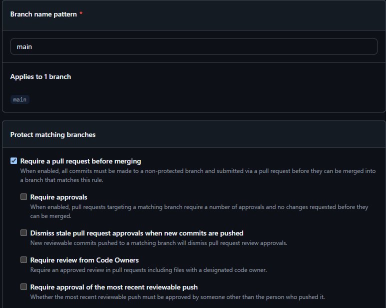
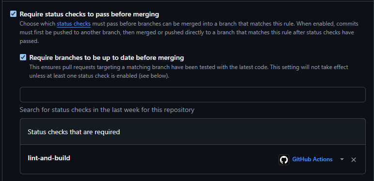

# Projeto Individual: Currículo Online DS881

Este repositório contém a implementação do meu currículo profissional desenvolvido como atividade prática da disciplina **DS881 - DevOps e Integração Contínua** (UFPR).

## 🚀 Link do Projeto em Produção
O currículo está publicado e disponível no link abaixo:
👉 **[Currículo Online - Dyego](https://dasko7b.github.io/ds881-curriculo-GRR20242244/)**

---

## 🛠️ Stack Tecnológica
* **Frontend:** HTML5 (estrutura semântica), CSS3 (estilização moderna e responsiva com variáveis CSS, suporte a temas claro/escuro e glassmorphism) e JavaScript Vanilla.
* **Ferramenta de Build:** [Vite](https://vitejs.dev/) (para empacotamento ágil e suporte nativo a *Hot Module Replacement* / *Hot Reload*).
* **Conteinerização:** Docker e Docker Compose.
* **CI/CD:** GitHub Actions (validação estática com ESLint, teste de build e deploy automático para GitHub Pages).

---

## 🐳 Instruções para Execução do Ambiente Local via Docker

O ambiente está configurado para que o projeto possa ser editado e testado localmente sem a exigência de instalar linguagens ou dependências base no sistema operacional da máquina hospedeira.

### Pré-requisitos
* Ter o **Docker** e o **Docker Compose** instalados na sua máquina.

### Como Executar

1. **Clonar o Repositório:**
   ```bash
   git clone https://github.com/Dasko7b/ds881-curriculo-GRR20242244.git
   cd ds881-curriculo-GRR20242244
   ```

2. **Iniciar o Contêiner:**
   Execute o comando abaixo para construir a imagem (caso seja a primeira execução) e subir o servidor de desenvolvimento:
   ```bash
   docker compose up --build
   ```
   *Nota:* Se estiver em versões mais antigas do docker, use `docker-compose up --build`.

3. **Acessar a Aplicação:**
   Abra seu navegador e acesse:
   👉 **[http://localhost:8080](http://localhost:8080)**

4. **Hot Reload (Atualização Automática):**
   Com o contêiner rodando, qualquer alteração salva nos arquivos `index.html`, `style.css` ou `main.js` será atualizada e refletida automaticamente no navegador instantaneamente devido ao mapeamento de volume local configurado no `docker-compose.yml` e o recurso de polling do Vite.

5. **Parar o Servidor:**
   Para finalizar o serviço, basta pressionar `Ctrl + C` no terminal onde o compose está rodando ou executar em outro terminal:
   ```bash
   docker compose down
   ```

---

## ⚙️ Configuração de Governança de Git e Proteção de Branch (`main`)

Para assegurar a integridade do código em produção, foi configurada a regra de **Branch Protection** diretamente no repositório do GitHub com as seguintes diretrizes:

### Passo a Passo da Configuração no GitHub:
1. No repositório, acesse a aba **Settings** (Configurações).
2. No menu lateral esquerdo, clique em **Branches**.
3. Na seção **Branch protection rules**, clique em **Add branch protection rule** (ou edite a regra para `main`).
4. No campo **Branch name pattern**, insira `main`.
5. Marque as seguintes opções:
   * **[x] Require a pull request before merging:**
     * **[x] Require approvals:** Define o fluxo de revisão antes de aceitar código na branch principal.
   * **[x] Require status checks to pass before merging:**
     * Pesquise e adicione o status check: `lint-and-build` (garantindo que o pipeline de linter e compilação do Actions deve estar verde para liberar o merge).
   * **[x] Do not allow bypassing the above settings:** Aplica as regras mesmo para administradores do repositório.
6. Clique em **Save changes** no final da página.

### Descrição Visual da Regra Ativa:
> A branch `main` está protegida contra commits diretos (`git push origin main` falhará). Qualquer alteração deve seguir o fluxo de criação de uma branch de feature (ex: `feat/nome-da-feature`), abertura de um **Pull Request (PR)**, aprovação e execução bem-sucedida de todas as verificações do pipeline de CI antes de poder ser mesclada (*merged*).

*(O print da tela de configurações com as regras ativas deve ser anexado abaixo caso necessário pelo fluxo de entrega)*

---

## 🧪 Pipeline de CI/CD (GitHub Actions)

A automação está descrita em [.github/workflows/main.yml](.github/workflows/main.yml) e é dividida em dois jobs principais:

1. **Lint and Build (`lint-and-build`):**
   * Disparado em qualquer *push* ou *pull request* direcionado à branch `main`.
   * Realiza a checagem sintática do JavaScript via `ESLint` (`npm run lint`).
   * Valida se a aplicação compila corretamente para produção com o Vite (`npm run build`).
   * Se for uma execução na branch `main` após um merge, empacota os arquivos gerados em `dist/` e faz o upload do artefato.

2. **Deploy (`deploy`):**
   * Disparado exclusivamente após o sucesso do job de `lint-and-build` na branch `main`.
   * Realiza a publicação no GitHub Pages de forma automatizada e segura sem a necessidade de chaves extras (`deploy-pages`).

---

## 📸 Comprovação de Branch Protection
Abaixo está o print comprovando a configuração da regra de proteção da branch `main` no GitHub:



